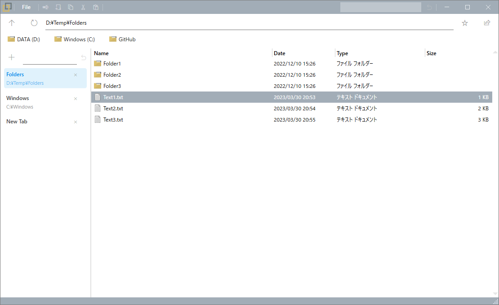

# SideFiler
 
this app can switch folders with side tabs.   
 

## Use Library
using the following libraries:

### [MahApps.Metro](https://github.com/MahApps/MahApps.Metro)
MIT License
### [Material Design In XAML Toolkit](https://github.com/MaterialDesignInXAML/MaterialDesignInXamlToolkit)
MIT License
### [ModernWPF UI Library](https://github.com/Kinnara/ModernWpf)
MIT License
### [NLog](https://nlog-project.org/)
BSD license
### [Microsoft.Extensions.DependencyInjection](https://dotnet.microsoft.com/)
MIT License


### [Dapper](https://github.com/DapperLib/Dapper)
Apache-2.0

### [SQLite](https://system.data.sqlite.org/)
[License](https://www.sqlite.org/copyright.html)

## Future
- Bookmarks
- Color Settings
- Recent Close Folers

## Use dark mode(future)

theme -> MaterialDesign, MahApps.Metro Theme    
accentColor -> MaterialDesignColor Primary   
tabColor -> MaterialDesignColor Secondary   
baseColor -> MahApps.Metro Theme

ui_settings.json

```json
{
    "theme": "dark",
    "accentColor": "grey",
    "tabColor": "lightBlue",
    "baseColor": "steel",
}
```

equal
```
 MahApps.Metro;component/Styles/Themes/Dark.Steel.xaml
 materialDesign:BundledTheme BaseTheme="Light" PrimaryColor="Grey" SecondaryColor="LightBlue"
```

## BookMarks(future)

bookmarks.json

```json
[
    {"name":"DATA(D:)", "path":"D://"  },
    {"name":"Windows(C:)", "path":"C://"  }
]
```
## ContextMenu(future)

context_menu.json

```json
[
    {
        "icon": null,
        "content": "Open with sakura",
        "app": "C:\\Program Files (x86)\\sakura\\sakura.exe",
        "commandline": "\"%1\"",
        "multiple": "roop",
        "delimiter": null,
        "target": "file",
        "extension": null
    },
    {
        "icon": null,
        "content": "Open with code",
        "app": "C:\\Users\\****\\AppData\\Local\\Programs\\Microsoft VS Code\\Code.exe",
        "commandline": "%1",
        "multiple": "combine",
        "delimiter": " ",
        "target": "file",
        "extension": null
    },
    {
        "icon": null,
        "content": "Open new XXXX",
        "app": "XXXX.exe",
        "commandline": "%1",
        "multiple": "roop",
        "delimiter": " ",
        "target": "file",
        "extension": [
            "Xxx","XxXx"
        ]
    }
]
```
## Directory Structure 
<pre>
(install)/
   ├ SideFiler.exe
   ├ ui_settings.json
   ├ bookmarks.json
   └ context_menu/
      ├ context_menu.json
      ├ xxx_icon.png
</pre>

## Japanese
Edge風にサイドでフォルダを切り替えできるようなファイラー。   
ただし、できることが少ないので、ほぼ閲覧用。   
色設定、最近閉じたタブは実装したい。   
あとは、右クリックメニュー、ブックマークバーは設定も追加したい。

